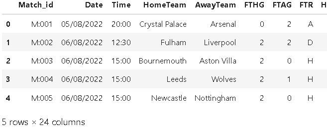
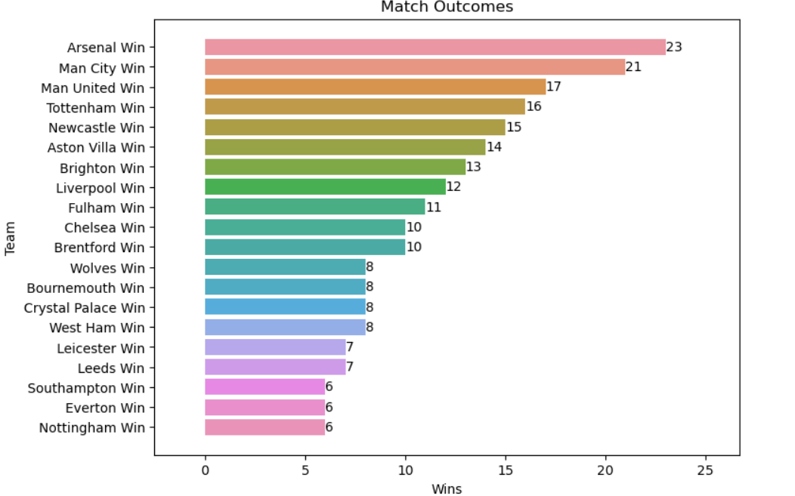
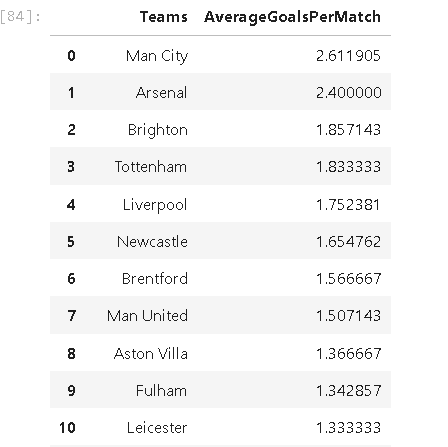
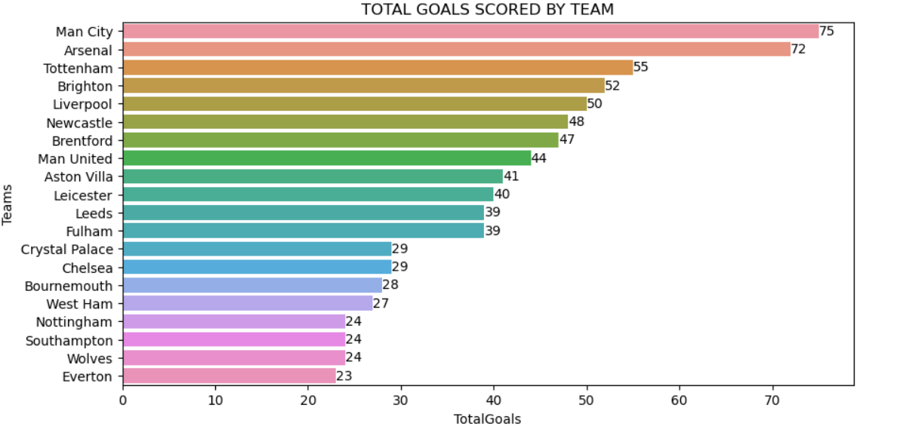
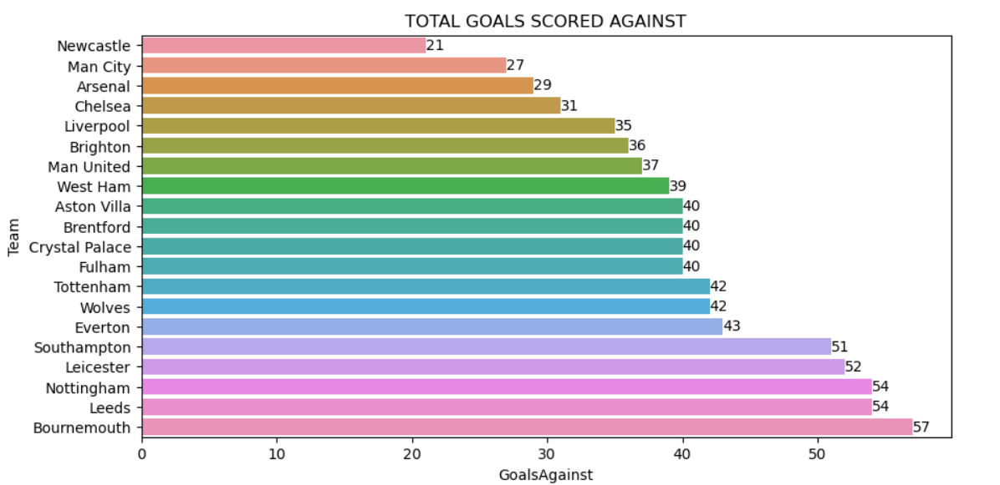

# EPL 2022- 2023 Match Exploratory Data Analysis

## Problem Statement
This project analyzes English priemier leagues matches for the 2022/2023 to gain insights into various aspects of the game. The data includes information about match outcomes, goals scored,average goals scored per match , yellow cards received, and officiating  for different teams

## Data
The project utilizes a dataset from kaggle containing detailed information about football matches, including the home team, away team, full-time home goals (FTHG), full-time away goals (FTAG), full-time result (FTR), yellow cards, (HY and AY) and much more 
[kaggle](https://www.kaggle.com/datasets/evangower/premier-league-2022-2023)

## limitations
the datase is only up to match week 27
analysis on players performances could be done because the dataset has no player data

----

## Data Preparation and Cleaning

In order to conduct the football match analysis, the following data preparation and cleaning steps were performed:

1. **Loading the Data**: The data was loaded using the pandas library. Two CSV files were used: "epl_clubs_info_2022-23.csv" containing information about the clubs, and "epl_results_2022-23.csv" containing match results.
`df1 = pd.read_csv("C:/Users/file")`

2. **Initial Data Exploration**: The `.head()` function was used to display the first few rows of each dataset, giving an overview of the data structure and column names.

3. **Handling Missing Values**: The `.isnull().sum()` function was applied to check for missing values in the dataset. If any missing values were found, appropriate methods such as imputation or dropping rows/columns were applied to handle them.

4. **Data Transformation**: Several data transformations were performed to make the data more suitable for analysis. The "Div" column was dropped as it was not relevant to the analysis. The "Date" and "Time" columns were converted to datetime format for easier manipulation and analysis.

5. **Feature Engineering**: Additional features were derived from the existing data to provide more insights. For example, a "Match_id" column was created to uniquely identify each match, and a "team_goal" column was created by summing the home team goals and away team goals.

6. **Grouping and Aggregation**: The data was grouped by teams (both home and away) to calculate various statistics such as total goals scored, goals against, corners, fouls, average goals per match and offside.

## Visualizations 
Matplotlib and seaborn libraries were utilized to create meaningful visualizations to represent the analyzed data. Bar plots were used to display total goals scored by each team, goals scored against each team, number of matches officiated by each referee, and total offsides by each team.

**Match Outcome and Results**: Functions were implemented to determine the match outcome (win, loss, or draw) based on the "FTR" (Full-Time Result) column. The number of wins and losses for each team were calculated and visualized using bar plots.

  
  
   
   
 other analysis such as number of matches officiated by referees, total offsides by teams and corners can be found in the  [Jupyter Notebook](EPL2022-2023.ipynb).
 
Data Export: The final cleaned and analyzed data was exported to a CSV file named "EPL_GAMES"using the syntax `df.to_csv('EPL_GAMES')`for further use

For the detailed code implementation and visualization examples, please refer to the [Jupyter Notebook](EPL2022-2023.ipynb) used for this project.

